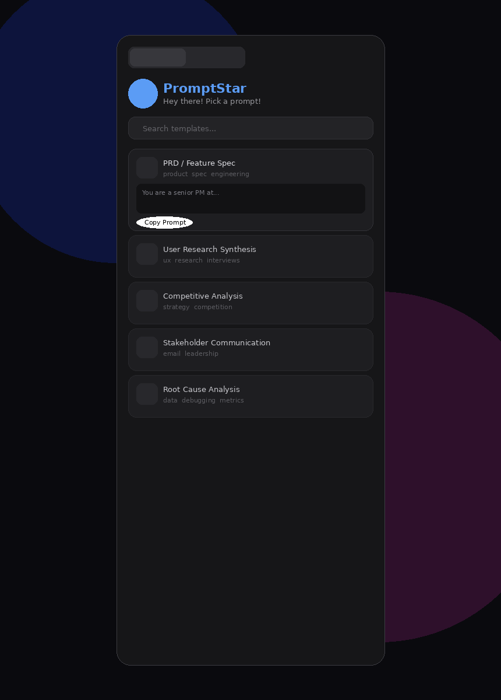
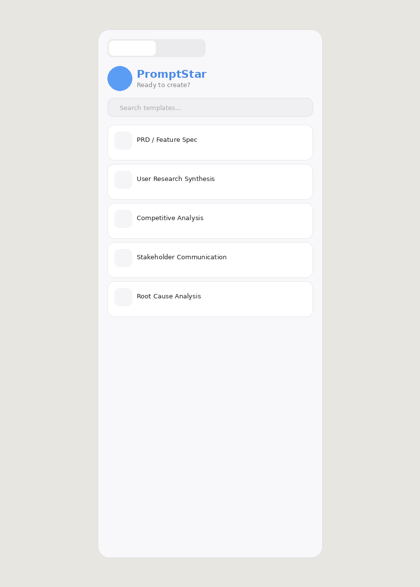
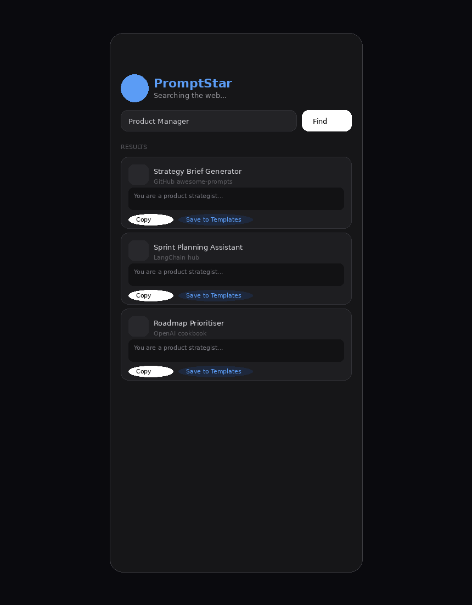
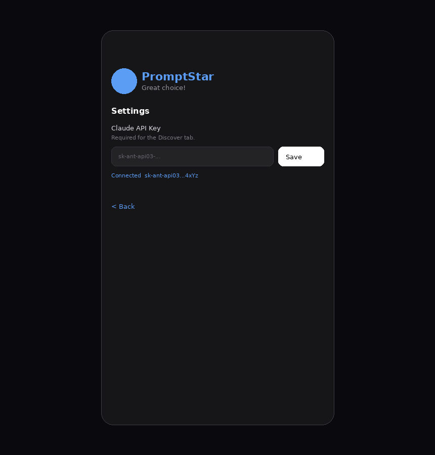

# PromptStar ⭐

> Your starfish-powered LLM prompt template library — a Chrome extension with an interactive mascot, AI-powered prompt discovery, and a dark glass UI.

<p align="center">
  
  
</p>

---

## What is PromptStar?

PromptStar is an open-source Chrome extension that gives you instant access to curated LLM prompt templates from any webpage. Press `⌥P` (Option+P on Mac / Alt+P on Windows) and a sleek frosted-glass modal appears on the right side of your screen — draggable, resizable, with a friendly blue starfish character that reacts to everything you do.

It ships with 5 battle-tested PM/engineering prompt templates and can **discover new ones using Claude AI**, which you can then save to your personal library.

---

## Features

### 📋 Template Library
Five hardcoded, production-ready prompt templates for common workflows: PRD writing, user research synthesis, competitive analysis, stakeholder emails, and root cause analysis. Search and filter instantly.

### 🔍 AI-Powered Discover
Enter your job role (e.g. "Data Scientist", "UX Designer") and Claude finds 4 tailored prompt templates from across the internet. Requires a Claude API key set via the in-app Settings panel.

<p align="center">
  
</p>

### 💾 Save & Delete
- **Save** any discovered prompt to your Templates tab with one click
- **Delete** any template (built-in or saved) — built-ins can be restored by clearing localStorage

### ⚙️ In-App Settings
Add your Claude API key directly from the modal — no console commands needed. Keys are stored locally in your browser and never leave your machine.

<p align="center">
  
</p>

### 🌙 Dark / Light Mode
Toggle between a translucent dark glass modal and a frosted light mode. Your preference persists across sessions.

### 🖱️ Drag & Resize
Grab the top bar to drag the modal anywhere. Grab the bottom-right corner to resize. Position and size persist across sessions.

### 🐙 Interactive Starfish Mascot
A blue starfish character with **8 animated moods** that reacts to your actions:

| Mood | Trigger | What happens |
|---|---|---|
| 👋 Wave | Opening the modal | Right arm waves |
| 🔍 Search | Typing in search | Top arm tilts |
| 🤔 Thinking | Discover loading | Gentle float |
| 🎉 Celebrate | Copying a prompt | Happy squint eyes, bouncy arms |
| 💙 Love | Saving a template | Heart eyes, pulsing body |
| 😴 Sleep | Random click | Zzz text, closed eyes, swaying |
| 😵 Dizzy | 5 rapid clicks | X eyes, wobbly spin |
| 😌 Idle | Discover tab | Slow rocking |

Click the starfish to cycle through random moods. Click it 5 times fast and it gets dizzy!

---

## Architecture

```
promptstar/
├── src/                        # Extension source (loaded into Chrome)
│   ├── manifest.json           # Manifest V3 — permissions, shortcuts, metadata
│   ├── background.js           # Service worker — listens for ⌥P, injects scripts on demand
│   ├── content.js              # Main app — UI, state, rendering, drag/resize, API calls
│   ├── templates.js            # Template data layer — load/save/delete via localStorage
│   ├── styles.css              # Minimal page-level root styles
│   └── icons/                  # Extension toolbar icons (16, 48, 128px)
├── screenshots/                # UI mockups for documentation
├── docs/                       # Additional documentation
│   └── ARCHITECTURE.md         # Detailed technical architecture
├── .gitignore
├── LICENSE
└── README.md
```

### How it works

```
┌─────────────┐     ⌥P / click icon     ┌──────────────┐
│  background  │ ──────────────────────► │  content.js   │
│  .js         │  sendMessage()          │  (injected)   │
│  (service    │ ◄────────────────────── │               │
│   worker)    │  chrome.runtime         │  Shadow DOM    │
└─────────────┘                          │  ┌──────────┐ │
                                         │  │ Modal UI │ │
                                         │  │ Starfish │ │
                                         │  │ Tabs     │ │
                                         │  └──────────┘ │
                                         │       │       │
                                         │       ▼       │
                                         │  localStorage │
                                         │  ┌──────────┐ │
                                         │  │templates │ │
                                         │  │api key   │ │
                                         │  │theme     │ │
                                         │  │position  │ │
                                         │  └──────────┘ │
                                         │       │       │
                                         │       ▼       │
                                         │  Anthropic    │
                                         │  Claude API   │
                                         │  (Discover)   │
                                         └──────────────┘
```

### Key Technical Decisions

| Decision | Rationale |
|---|---|
| **Shadow DOM** | Complete CSS isolation — extension styles never leak into host pages and vice versa |
| **No framework** | Zero dependencies, ~36KB total. Vanilla JS keeps it fast and simple |
| **Manifest V3** | Required for Chrome Web Store. Uses service worker, not persistent background page |
| **Dynamic injection** | `background.js` programmatically injects scripts if content script hasn't loaded yet (fixes the "receiving end does not exist" error on pre-existing tabs) |
| **localStorage** | Persists templates, API key, theme, position, and size. No server, no accounts, no tracking |
| **CSS-in-JS theming** | `getCSS(darkMode)` generates the full stylesheet with theme-aware tokens. Allows seamless dark/light toggle without class-swapping complexity |
| **Caveat font** | Irregular handwritten feel for "PromptStar" title — distinctive and playful, loaded via Google Fonts CDN |

### Data Flow

1. **Default templates** live in `templates.js` as `DEFAULT_TEMPLATES`
2. **User-saved templates** are stored in `localStorage` key `ps-templates`
3. **Deleted built-ins** tracked in `ps-deleted` (so they don't reappear)
4. `loadTemplates()` merges defaults (minus deleted) + saved into `PROMPT_TEMPLATES`
5. **Discover** calls Claude API → returns JSON array → rendered with "Save" buttons
6. **Save** pushes to `ps-templates`, **Delete** either adds to `ps-deleted` (builtins) or removes from `ps-templates` (saved)

### API Integration

The Discover tab calls `https://api.anthropic.com/v1/messages` with:
- Model: `claude-sonnet-4-20250514`
- System prompt requesting exactly 4 JSON template objects
- Header `anthropic-dangerous-direct-browser-access: true` (required for browser-side calls)
- API key from `localStorage` key `ps-api-key`

---

## Installation

### From source (Developer mode)

1. Clone this repo:
   ```bash
   git clone https://github.com/yourusername/promptstar.git
   cd promptstar
   ```

2. Open Chrome → `chrome://extensions/`

3. Enable **Developer mode** (top-right toggle)

4. Click **Load unpacked** → select the `src/` folder

5. Press **⌥P** (Mac) or **Alt+P** (Windows) on any webpage

### Set up Discover

1. Get a Claude API key from [console.anthropic.com](https://console.anthropic.com) ($5 minimum credits)
2. Click the **⚙ gear icon** in PromptStar
3. Paste your `sk-ant-...` key and hit **Save**

---

## Usage

| Action | How |
|---|---|
| Open/close modal | `⌥P` or click toolbar icon |
| Search templates | Type in the search bar |
| Copy a prompt | Expand card → click **Copy** |
| Delete a template | Expand card → click **Delete** |
| Discover prompts | Switch to Discover tab → enter role → click **Find** |
| Save discovered prompt | Click **Save to Templates** on any result |
| Change theme | Click ☀/🌙 icon in top bar |
| Drag modal | Grab the top bar and drag |
| Resize modal | Drag bottom-right corner handle |
| Poke the starfish | Click it! (5x fast = dizzy) |

---

## Keyboard Shortcuts

| Shortcut | Action |
|---|---|
| `⌥P` / `Alt+P` | Toggle PromptStar |
| `Escape` | Close modal |
| `Enter` | Submit role in Discover tab |

To customise the shortcut: `chrome://extensions/shortcuts`

---

## Tech Stack

- **Vanilla JavaScript** — no React, no build step, no bundler
- **Shadow DOM** — full style encapsulation
- **Chrome Manifest V3** — modern extension architecture
- **Anthropic Claude API** — AI-powered template discovery
- **Google Fonts** — Caveat (handwritten title), Outfit (body), Geist Mono (code)
- **localStorage** — all persistence, zero server dependency

---

## Contributing

Contributions welcome! Some ideas:

- [ ] Add template categories / folders
- [ ] Import/export templates as JSON
- [ ] Prompt variable editor (replace `[placeholders]` inline)
- [ ] Firefox / Safari port
- [ ] Chrome Web Store listing
- [ ] More starfish moods and Easter eggs
- [ ] Prompt sharing via URL

### Development

1. Edit files in `src/`
2. Go to `chrome://extensions/` → click reload (🔄) on PromptStar
3. Press `⌥P` to test changes

No build step needed — it's all vanilla JS.

---

## License

MIT License. See [LICENSE](LICENSE) for details.

---

## Credits

Built by [Akshat Tandon](https://github.com/akshattandon007) during a vibe coding session with Claude.

Design inspired by Apple's frosted glass modal sheets and Spotify's design system. The starfish mascot was hand-crafted in SVG with 8 animated mood states.

---

<p align="center">
  <strong>If you find PromptStar useful, give it a ⭐ on GitHub!</strong>
</p>
