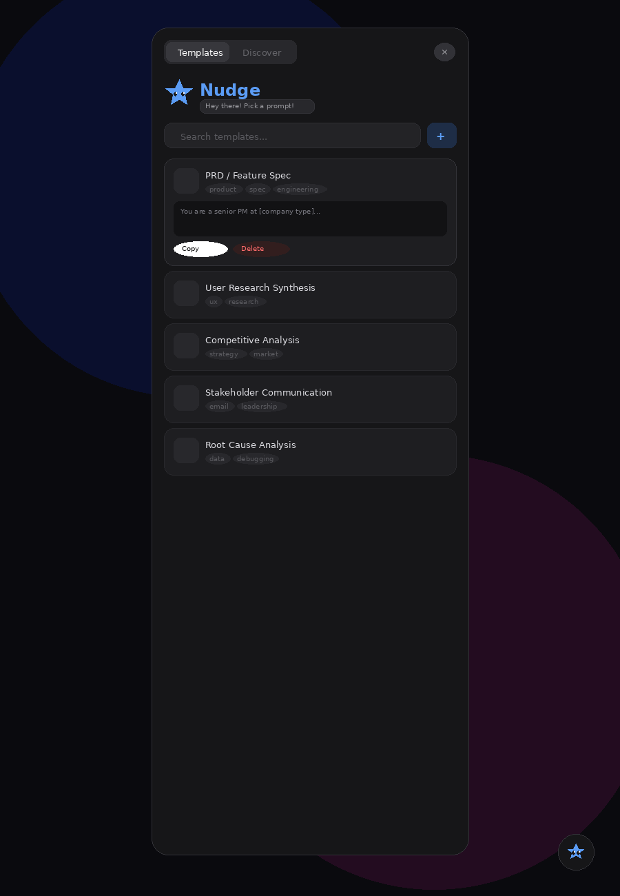
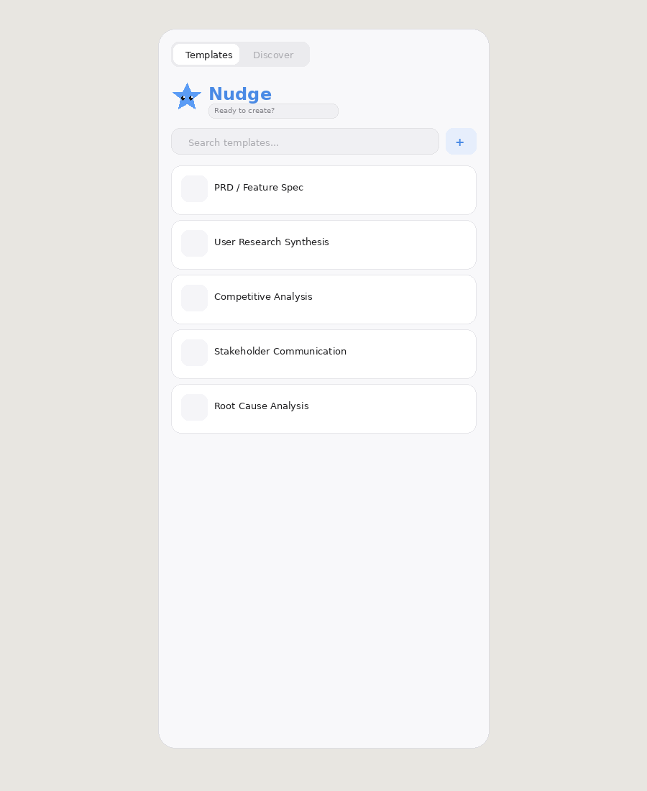
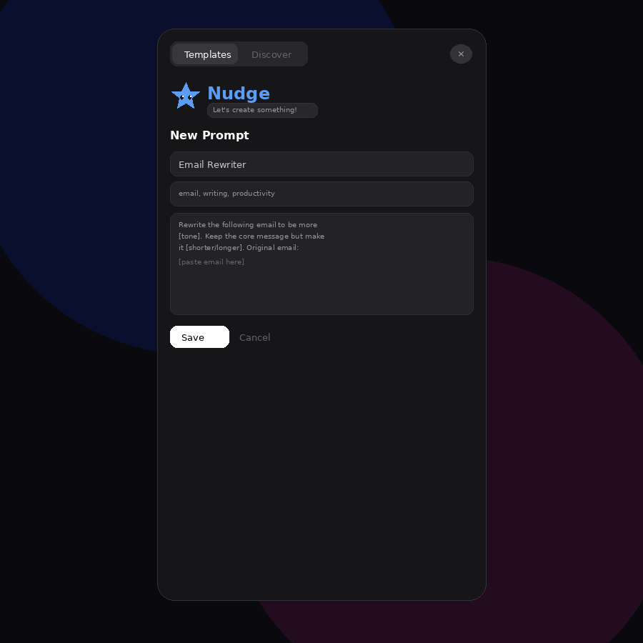
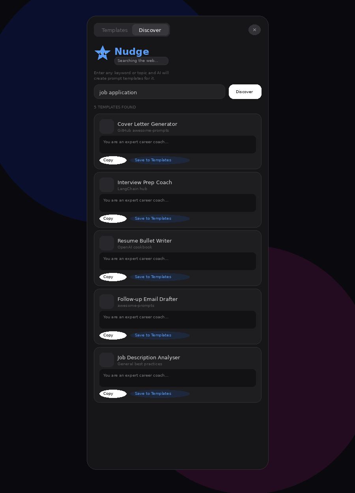
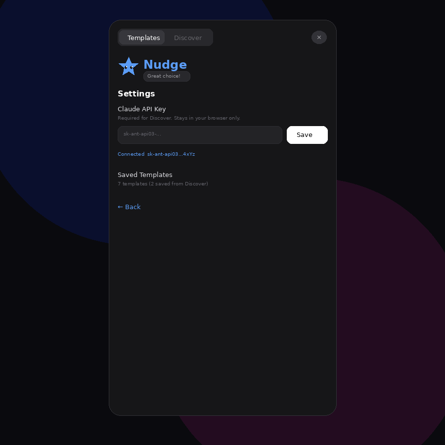
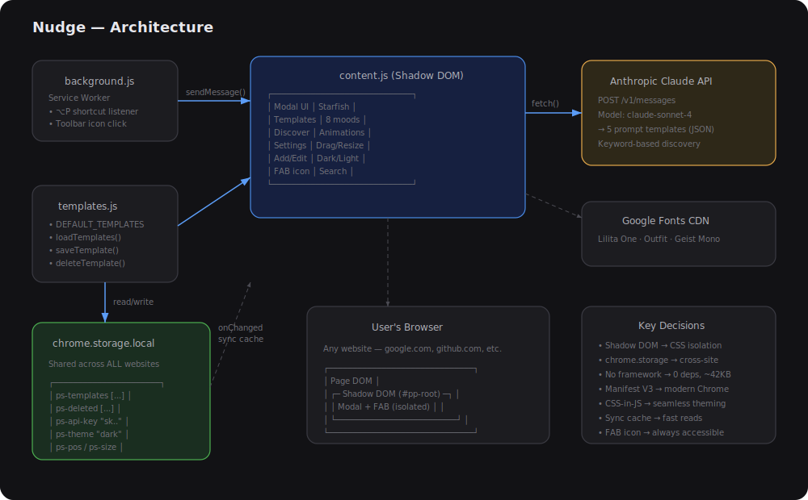

# Nudge 💙

> A Chrome extension that gives you instant access to LLM prompt templates — with AI-powered discovery, a playful blue starfish mascot, and a frosted glass UI.

<p align="center">
  
  &nbsp;&nbsp;
  
</p>

---

## What is Nudge?

Nudge is an open-source Chrome extension that puts curated LLM prompt templates one shortcut away. Press **⌥P** (Mac) or **Alt+P** (Windows) on any webpage and a sleek dark-glass modal appears. It ships with 5 battle-tested templates and can **discover new ones using Claude AI** based on any keyword you type.

Your entire prompt library — saved templates, API key, theme, modal position — syncs across all websites via `chrome.storage.local`. No server, no accounts, no tracking.

---

## Features

### 📋 Template Library (Add, Edit, Delete)
Five built-in prompt templates for PRD writing, user research, competitive analysis, stakeholder emails, and root cause analysis. Plus:
- **Add your own** — click the ⊕ button, fill in title/tags/prompt, save
- **Edit** any saved template inline
- **Delete** any template (built-ins can be restored)
- **Search** across all templates instantly

<p align="center">
  
</p>

### 🔍 AI-Powered Discover (Keyword-based)
Enter any keyword or topic — like "job application", "code review", or "meal planning" — and Claude generates **5 tailored prompt templates**. Each result has a **Save to Templates** button.

<p align="center">
  
</p>

### ⚙️ In-App Settings
Add your Claude API key directly from the modal. Keys are stored in `chrome.storage.local` and never leave your browser.

<p align="center">
  
</p>

### 🌙 Dark / Light Mode
Toggle between translucent dark glass and frosted light mode. Preference persists across sessions and websites.

### 🖱️ Drag & Resize
Grab the top bar to drag. Grab the bottom-right corner to resize. Position and size persist via `chrome.storage.local`.

### ⭐ Floating Action Button
A blue starfish FAB sits in the bottom-right corner of every page when the extension is active. Click it to open Nudge.

### 🐙 Interactive Starfish Mascot
A blue starfish with **8 animated moods** that reacts to your actions:

| Mood | Trigger | Visual |
|---|---|---|
| 👋 Wave | Opening modal | Arm waving |
| 🔍 Search | Typing in search | Arm tilting |
| 🤔 Thinking | Discover loading | Gentle float |
| 🎉 Celebrate | Copying a prompt | Happy eyes, bouncy |
| 💙 Love | Saving a template | Heart eyes, pulsing |
| 😴 Sleep | Random click | Zzz, swaying |
| 😵 Dizzy | 5 rapid clicks | X eyes, spinning |
| 😌 Idle | Discover tab | Slow rocking |

### 🔄 Cross-Site Sync
All data uses `chrome.storage.local` — your prompts, API key, theme, and position are the **same on every website**. Save a prompt on google.com, use it on github.com.

---

## Architecture

<p align="center">
  
</p>

### File Structure
```
nudge/
├── src/                        # Chrome extension (Load Unpacked this folder)
│   ├── manifest.json           # Manifest V3 — permissions, shortcuts
│   ├── background.js           # Service worker — shortcut + icon click handler
│   ├── content.js              # Main app — UI, state, render, drag/resize, API
│   ├── templates.js            # Data layer — CRUD via chrome.storage.local
│   ├── styles.css              # Root container styles
│   └── icons/                  # Toolbar icons (16, 48, 128px)
├── screenshots/                # Documentation screenshots
├── docs/
│   └── ARCHITECTURE.md         # Deep technical documentation
├── .gitignore
├── CONTRIBUTING.md
├── LICENSE                     # MIT
└── README.md
```

### Data Flow
```
User Action → content.js (render) → Shadow DOM (isolated UI)
                 ↓
         templates.js (sync cache)
                 ↓
      chrome.storage.local (persisted, cross-site)
                 ↓
      onChanged listener → cache sync → re-render
```

### Key Technical Decisions

| Decision | Why |
|---|---|
| **Shadow DOM** | Complete CSS isolation from host pages |
| **chrome.storage.local** | Cross-site persistence (replaces per-origin localStorage) |
| **Sync cache pattern** | Fast synchronous reads, async writes to storage |
| **No framework** | Zero dependencies, ~42KB total, no build step |
| **Manifest V3** | Modern Chrome extension standard |
| **CSS-in-JS** | `getCSS(darkMode)` generates full theme-aware stylesheet |
| **Dynamic injection** | background.js injects scripts if content script not loaded |
| **Lilita One font** | Chunky, bold display font for the "Nudge" title |

---

## Getting Started

### Prerequisites
- Google Chrome (or any Chromium browser)
- A Claude API key from [console.anthropic.com](https://console.anthropic.com) for the Discover feature (optional, $5 minimum credits)

### Installation

```bash
# Clone the repo
git clone https://github.com/akshattandon007/nudge.git
cd nudge
```

1. Open Chrome → `chrome://extensions/`
2. Enable **Developer mode** (top-right toggle)
3. Click **Load unpacked** → select the `src/` folder
4. Press **⌥P** (Mac) or **Alt+P** (Windows) on any page

### Set up Discover (optional)

1. Go to [console.anthropic.com](https://console.anthropic.com)
2. Create an account, add $5 credits
3. Go to **API Keys** → **Create Key** → copy the `sk-ant-...` key
4. In Nudge, click the **⚙ gear icon** → paste key → **Save**

### Keyboard Shortcuts

| Shortcut | Action |
|---|---|
| `⌥P` / `Alt+P` | Toggle Nudge |
| `Escape` | Close modal |
| `Enter` | Submit in Discover |

To customise: `chrome://extensions/shortcuts`

---

## Usage

| Action | How |
|---|---|
| Open/close | `⌥P` / click FAB / click toolbar icon |
| Search | Type in the search bar |
| Add new prompt | Click ⊕ → fill form → Save |
| Edit prompt | Expand saved card → Edit → Update |
| Delete prompt | Expand card → Delete |
| Copy prompt | Expand card → Copy |
| Discover prompts | Discover tab → type keyword → Discover |
| Save discovered | Click "Save to Templates" on any result |
| Settings | Click ⚙ gear icon |
| Theme toggle | Click ☀/🌙 |
| Drag modal | Grab top bar |
| Resize modal | Drag bottom-right corner |
| Poke starfish | Click it! (5x fast = dizzy) |

---

## Tech Stack

- **Vanilla JavaScript** — no React, no build step, no bundler
- **Shadow DOM** — full style encapsulation
- **chrome.storage.local** — cross-site persistence
- **Chrome Manifest V3** — modern extension architecture
- **Anthropic Claude API** — AI-powered template discovery
- **Google Fonts** — Lilita One (display), Outfit (body), Geist Mono (code)

---

## Contributing

Contributions welcome! See [CONTRIBUTING.md](CONTRIBUTING.md) for guidelines.

### Ideas
- [ ] Template categories / folders
- [ ] Import/export as JSON
- [ ] Inline placeholder editor (`[company]` → editable fields)
- [ ] Firefox / Safari port
- [ ] Chrome Web Store listing
- [ ] More starfish Easter eggs
- [ ] Prompt sharing via URL
- [ ] Template versioning

### Dev Workflow
1. Edit files in `src/`
2. `chrome://extensions/` → click 🔄 on Nudge
3. `⌥P` to test — no build step needed

---

## License

MIT — see [LICENSE](LICENSE).

---

## Credits

Built by [Akshat Tandon](https://github.com/akshattandon007).

The blue starfish mascot was hand-crafted in SVG with 8 animated mood states. Design inspired by Apple's frosted glass modal sheets.

---

<p align="center">
  <strong>If you find Nudge useful, give it a ⭐ on GitHub!</strong>
</p>
