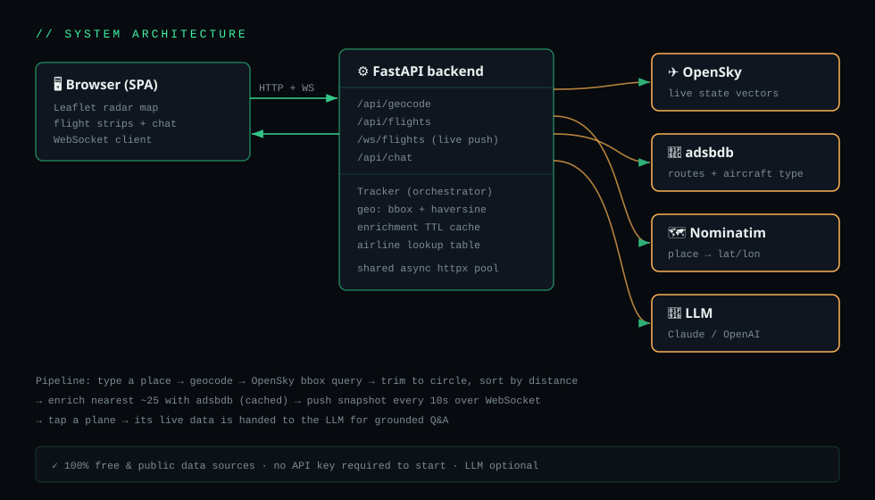

<p align="center">
  
</p>

<h1 align="center">✈️ Flights Over Me</h1>

<p align="center">
  <b>Point it at a place. See every aircraft overhead — live — and ask an AI what each one is.</b>
</p>

<p align="center">
  <a href="#-quick-start"></a>
  
  
  
  
  
</p>

---

## 🛰️ What is this?

**Flights Over Me** is a real-time overhead flight tracker with a built-in aviation expert. You give it a location — a city name, or your phone's GPS — and it paints every aircraft within range onto a dark "air-traffic-control" radar map. Tap a plane and you get the full story: airline, aircraft type, registration (tail number), origin → destination, altitude, speed, heading, and whether it's climbing, cruising, or descending.

Then comes the fun part: an **LLM aviation copilot** is wired into every flight. Ask *"what kind of plane is this?"*, *"how long is this route?"*, or *"why is it flying so low?"* and it answers using that aircraft's **live telemetry** as grounding.

It runs **100% on free, public data** and needs **no API key to start**.

> 🧑‍✈️ Built by aviation nerds, for aviation nerds. Every design choice — the radar sweep, the phosphor-green flight strips, the distance-sorted contact board — is there because that's how you'd actually want to watch the sky.

---

## ✨ Features

| | |
|---|---|
| 🗺️ **Live radar map** | Leaflet + dark CARTO tiles. Planes are real SVG markers that **rotate to their true heading** and **glide continuously in real time** — between data refreshes they're dead-reckoned forward from their reported velocity + heading, then smoothly reconciled to each new fix (no teleporting). |
| 📡 **Real ADS-B data** | Positions straight from the [OpenSky Network](https://opensky-network.org/). A precise lat/lon **bounding-box → true-circle** query means you only see what's actually overhead. |
| 📍 **"Above my house" mode** | One tap grabs your **precise GPS fix** (shown to ~1 m, with accuracy), drops a crosshair on the exact spot, and refines it live as the signal sharpens. Dial the radius down to **1 km** to see only what's truly overhead. |
| 👁️ **Where to look** | For every aircraft we compute the **compass bearing** and **elevation angle** from your exact position — so the app tells you literally where to point your eyes: *"look WSW, 52° above the horizon."* A pulsing **OVERHEAD NOW** banner fires when something is nearly straight up. |
| 🛬 **Rich flight details** | Callsign, **airline**, **aircraft type + manufacturer**, **tail number**, registration country, origin → destination airports, plus line-of-sight (slant) range — enriched from [adsbdb](https://www.adsbdb.com/). |
| 📋 **Contact board** | A sortable "flight strip" panel, **nearest-first**, just like a real ATC display. |
| 🤖 **Ask-the-expert LLM** | Tap any flight and chat about it. Pluggable: **Claude** (default), any **OpenAI-compatible** endpoint, or off. The model is fed the live flight data so answers are grounded, not guessed. |
| 🌍 **Type a place or use GPS** | Free-text geocoding via OpenStreetMap Nominatim, or one-tap **high-accuracy** browser geolocation that locks onto your house. Raw `lat, lon` works too, displayed at full precision. |
| ⚡ **Live, not polled-by-hand** | A **WebSocket** pushes a fresh snapshot every 10s. Open it and walk away — the board stays current. |
| 🆓 **Zero-cost by default** | No account, no key, no credit card to get flying. Add free OpenSky OAuth2 creds for higher limits when you want them. |
| 🧪 **Engineered properly** | Typed Pydantic models, async `httpx` with connection pooling, TTL caching, a clean service layer, 27 unit tests, Docker, and CI. |

---

## 🖼️ Screenshots

> The interface is a single dark "cockpit" screen: radar map on the left, contact board + flight detail + AI chat on the right.

```
┌──────────────────────────────────────────────────────────────────────────┐
│ ● FLIGHTS·OVER·ME   // LIVE ADS-B RADAR     [ 51.55512,-0.142 ] SCAN ◎ABOVE│
│                                              RADIUS [5km ▾]    ● LIVE · 3  │
├───────────────────────────────────────────────┬──────────────────────────┤
│            ╭─ BAW221 OVERHEAD · 👁 look WSW ─╮ │  CONTACTS    nearest first│
│                                                │ ➤ BAW221 ↑OVERHEAD        │
│                  ✈                             │   British Airways LHR→JFK │
│              ⊕  ← your house (±8 m)            │   👁 look WSW, 81° up      │
│           radius 5 km                          │   1.2km  37000ft   81° up │
│                ✈                               │ ─────────────────────────  │
│                                                │  FLIGHT  BAW221         ✕  │
│     (dark CARTO map, rotating planes)          │  👁 look WSW, 81° up       │
│                                                │  LHR ✈→ JFK               │
│                                                │  AIRCRAFT  Boeing 777-300ER│
│  📍 51.55512, -0.14267  ±8 m       3 contacts  │  ELEVATION 81° above horiz │
└───────────────────────────────────────────────┴──────────────────────────┘
```

*(The real thing has glow, a sweeping scanline, and smooth marker motion — try it locally, it's a 30-second setup.)* 🛫

---

## 🚀 Quick Start

You need **Python 3.11+**. That's it.

```bash
# 1. clone
git clone https://github.com/you/flights-over-me.git
cd flights-over-me

# 2. install (into a virtualenv)
python -m venv .venv && source .venv/bin/activate
pip install -e .

# 3. fly
python -m flights_over_me
```

Now open **http://localhost:8000**, type a city (try `London`, `Heathrow`, or your own town), hit **SCAN**, and watch the sky. 🛩️

> 🏠 **Want only what's above your roof?** Tap **◎ ABOVE ME** to lock onto your precise GPS coordinates, then set the **RADIUS to 1–5 km**. Each plane now shows a *"look WSW, 52° up"* hint, and an **OVERHEAD NOW** banner flashes when one is nearly straight up. (On the public web, browser geolocation needs HTTPS or `localhost` — both fine here.)

> 💡 Prefer one command? `make dev` runs it with autoreload. Or `docker compose up --build` if you'd rather containerize.

### 🤖 Turn on the AI copilot (optional)

The tracker works fully without it, but the *"ask the expert"* chat needs a model. Copy the env template and drop in a key:

```bash
cp .env.example .env
# then edit .env:
#   FOM_LLM_PROVIDER=anthropic
#   FOM_ANTHROPIC_API_KEY=sk-ant-...
```

Restart, tap a plane, and start asking. The chat box auto-hides if no key is configured, so nothing breaks either way.

---

## ⚙️ Configuration

Everything is environment-driven (12-factor) and prefixed `FOM_`. **All values are optional** — the defaults give you a working anonymous tracker. Copy [`.env.example`](.env.example) to `.env` to customize.

| Variable | Default | What it does |
|---|---|---|
| `FOM_HOST` / `FOM_PORT` | `0.0.0.0` / `8000` | Where the server binds. |
| `FOM_DEFAULT_RADIUS_KM` | `50` | Starting search radius. |
| `FOM_MAX_RADIUS_KM` | `250` | Hard cap to keep OpenSky queries sane. |
| `FOM_POLL_INTERVAL_S` | `10` | How often the live WebSocket refreshes. |
| `FOM_OPENSKY_CLIENT_ID` / `_SECRET` | _none_ | Free OpenSky OAuth2 creds → higher rate limits + 5s resolution. |
| `FOM_LLM_PROVIDER` | `anthropic` | `anthropic` · `openai` · `none`. |
| `FOM_LLM_MODEL` | `claude-sonnet-4-5` | Model name for the chosen provider. |
| `FOM_ANTHROPIC_API_KEY` | _none_ | Enables the Claude copilot. |
| `FOM_OPENAI_API_KEY` / `_BASE_URL` | _none_ | Use any OpenAI-compatible endpoint instead. |
| `FOM_USER_AGENT` | `flights-over-me/1.0 …` | Sent to the free APIs — please identify yourself, it's their usage policy. |

---

## 🧭 How it works

<p align="center">
  
</p>

The pipeline, end to end:

1. **📍 Locate** — you type a place (or share GPS). A place name is geocoded to coordinates via **Nominatim**; raw `lat, lon` skips the network entirely.
2. **📐 Frame** — we convert `(lat, lon, radius)` into the lat/lon **bounding box** OpenSky needs. Latitude degrees are ~constant; longitude degrees are scaled by `cos(latitude)` so the box stays honest near the poles.
3. **📡 Fetch** — one call to OpenSky's `/states/all` returns every tracked aircraft in the box. We then trim the rectangle down to a **true circle** with the haversine distance and **sort nearest-first**.
4. **👁️ Aim** — for each in-range aircraft we compute, relative to your exact spot, the **bearing** (which way to face), the **elevation angle** (how high to look — 90° is straight up), and the **slant range** (true line-of-sight distance). Anything above ~75° elevation is flagged *directly overhead*.
5. **🛬 Enrich** — for the closest ~25 contacts we fan out **concurrently** to adsbdb for route + aircraft type + tail number. Results are **TTL-cached** (routes don't change mid-flight), so we stay polite and fast.
6. **🔄 Stream** — the assembled snapshot is pushed over a **WebSocket** every `POLL_INTERVAL_S`. Between pushes the browser **dead-reckons** each plane forward from its velocity + heading and eases it onto every new fix, so markers glide continuously in real time instead of jumping; new contacts fade in and departed ones drop off.
7. **🤖 Explain** — tap a plane and its live JSON is handed to the LLM under an aviation-expert system prompt for **grounded** Q&A.

### 📚 Data sources (all free, all public)

- **[OpenSky Network](https://opensky-network.org/)** — community ADS-B/Mode-S positions. Anonymous works; free OAuth2 raises the ceiling.
- **[adsbdb](https://www.adsbdb.com/)** — callsign → route and ICAO24 → aircraft type/registration.
- **[OpenStreetMap Nominatim](https://nominatim.org/)** — place-name geocoding.
- **[CARTO dark basemap](https://carto.com/basemaps/)** + **OpenStreetMap** tiles — the map itself.

> ⚠️ **Coverage honesty:** ADS-B is crowd-sourced, so coverage is excellent over Europe/North America and patchier over open ocean and some regions. Military/private aircraft may be absent or unidentified, and not every callsign has a known route. The app degrades gracefully — you'll always get position + telemetry, and enrichment fills in when it can.

---

## 🔌 API reference

The frontend is just a client of a small, documented HTTP/WS API. Interactive docs live at **`/docs`** (Swagger) when the server is running.

| Method | Endpoint | Purpose |
|---|---|---|
| `GET` | `/api/health` | Status + which features are enabled. |
| `GET` | `/api/geocode?q=London` | Resolve a place name or `lat,lon` → `{name, lat, lon}`. |
| `GET` | `/api/flights?lat=&lon=&radius_km=` | One-shot snapshot of overhead flights, nearest-first. |
| `WS` | `/ws/flights?lat=&lon=&radius_km=` | Live stream — a fresh snapshot every poll interval. |
| `POST` | `/api/chat` | `{question, flight}` → grounded LLM answer about that flight. |

```bash
# Try the one-shot endpoint (London, 50 km):
curl "http://localhost:8000/api/flights?lat=51.5074&lon=-0.1278&radius_km=50"
```

---

## 🗂️ Project structure

```
flights-over-me/
├── flights_over_me/            # 🐍 the application package
│   ├── main.py                 #    FastAPI app, lifespan, static serving
│   ├── config.py               #    env-driven settings (pydantic-settings)
│   ├── models.py               #    typed Pydantic models
│   ├── geo.py                  #    bounding-box + haversine (pure, tested)
│   ├── api/
│   │   ├── routes.py           #    REST endpoints
│   │   ├── websocket.py        #    live stream
│   │   └── deps.py             #    dependency wiring
│   ├── services/
│   │   ├── opensky.py          #    📡 OpenSky client (+ OAuth2)
│   │   ├── enrichment.py       #    🛬 adsbdb routes/aircraft (+ TTL cache)
│   │   ├── geocoding.py        #    🗺️ Nominatim
│   │   ├── airlines.py         #    🏷️ callsign → airline
│   │   ├── llm.py              #    🤖 Claude / OpenAI copilot
│   │   └── tracker.py          #    🧩 orchestrates a full snapshot
│   └── data/airlines.json      #    bundled ICAO airline table
├── frontend/                   # 🎨 single-page radar UI
│   ├── index.html
│   ├── style.css               #    the ATC/cockpit theme
│   └── app.js                  #    map, websocket, markers, chat
├── tests/                      # 🧪 27 unit tests
├── assets/ · docs/             # 🖼️ banner + architecture diagram
├── Dockerfile · docker-compose.yml · Makefile
├── pyproject.toml · requirements.txt · .env.example
└── .github/workflows/ci.yml    # ✅ lint + test on 3.11 & 3.12
```

---

## 🧪 Development

```bash
pip install -e ".[dev]"   # runtime + dev tools
make dev                  # autoreloading server
make test                 # pytest  (27 tests)
make lint                 # ruff
make fmt                  # ruff --fix + format
```

The geometry and parsing logic is fully unit-tested, including the OpenSky parser against a real sample state vector and the circle-filter against a mocked HTTP transport — no network needed to run the suite.

---

## 🛣️ Roadmap

- [ ] 🛫 Flight **trails** — draw the recent track behind each aircraft
- [ ] 🔔 **Alerts** — "ping me when a 747 / an A380 / this tail number is overhead"
- [ ] 📊 Squawk-code decoding + emergency (7500/7600/7700) highlighting
- [ ] 🛩️ Aircraft silhouettes per type instead of a generic glyph
- [ ] 💾 Optional Redis cache for multi-process deployments
- [ ] 🌐 Multiple simultaneous observers / saved locations
- [ ] 📱 PWA install + offline shell

PRs welcome — see below. 👇

---

## 🤝 Contributing

1. Fork & branch (`git checkout -b feature/trails`)
2. `pip install -e ".[dev]"` and add tests for your change
3. `make lint && make test` must be green
4. Open a PR with a clear description

Good first issues: widen `data/airlines.json` (drop in the full OpenFlights table), add aircraft-type silhouettes, or build flight trails. 🛠️

---

## 🙏 Acknowledgements

This project stands on the shoulders of generous open data:

- The **[OpenSky Network](https://opensky-network.org/)** and its volunteer ADS-B feeders 📡
- **[adsbdb](https://www.adsbdb.com/)** for free route & aircraft lookups 🛬
- **[OpenStreetMap](https://www.openstreetmap.org/)**, **[Nominatim](https://nominatim.org/)**, **[CARTO](https://carto.com/)**, and **[Leaflet](https://leafletjs.com/)** 🗺️

If you use OpenSky in research, please cite them — they've earned it.

---

## 📜 License

[MIT](LICENSE) — do what you like, just keep the notice.

<p align="center"><sub>Made for everyone who's ever looked up and wondered <i>"where's that one going?"</i> ✈️</sub></p>
