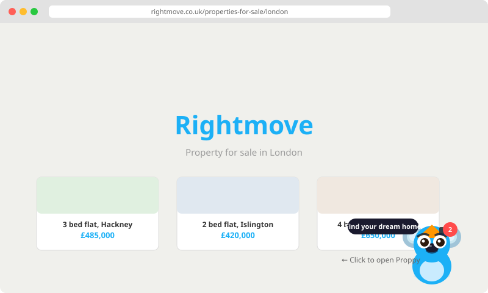
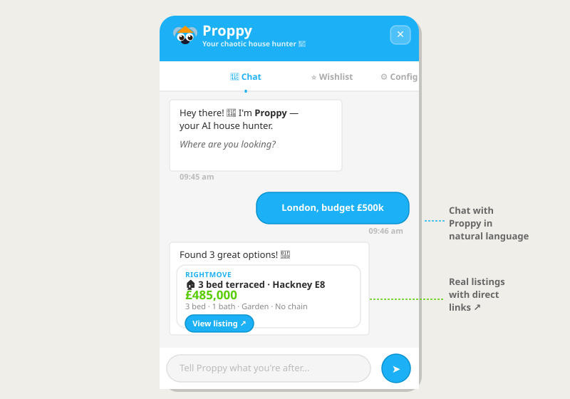
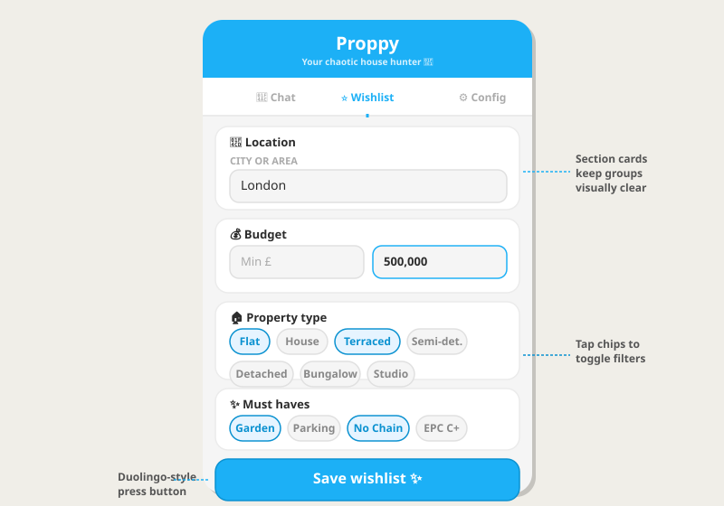
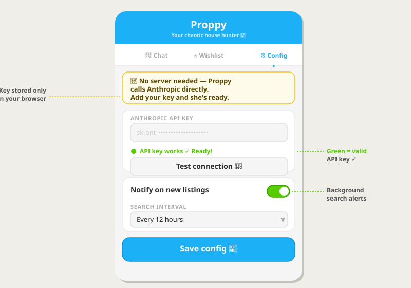
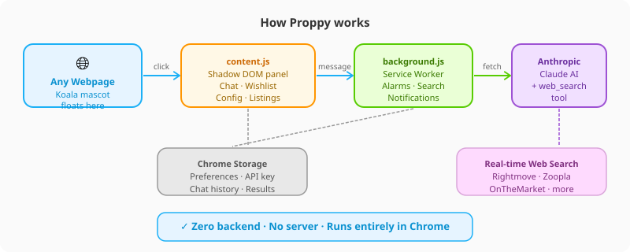

<div align="center">



# 🏡 Proppy

### Your gloriously unhinged AI house-hunting sidekick

[](https://developer.chrome.com/docs/extensions/)
[](https://anthropic.com)
[](LICENSE)
[](README.md)

> *"She searches Rightmove, Zoopla, OnTheMarket and the entire internet so you don't have to suffer through property portals at midnight."*

</div>

---

## What is Proppy?

Proppy is a Chrome browser extension that injects an animated koala mascot into every page you visit. Click her, and a full AI-powered property search assistant pops up — right on the page, no new tab needed.

She uses **Claude AI with real-time web search** to find actual listings from property sites across the internet, filtered by your exact preferences. She asks the right questions, remembers your wishlist, and pings you whenever she finds something new.

**No backend. No server. No local process to keep running.** She calls the Anthropic API directly from the extension.

---

## Features

| Feature | Details |
|---|---|
| 🐨 **Animated koala mascot** | Floats on every page, bounces, blinks, wags — Duolingo-style character design |
| 💬 **Natural language chat** | Talk to Proppy like a person — she asks all the right questions |
| 🔍 **Real web search** | Searches Rightmove, Zoopla, OnTheMarket, PrimeLocation + more via Claude's web search |
| 🔗 **Direct listing links** | Every result includes a link to the actual property page |
| ⭐ **Persistent wishlist** | Saves your location, budget, type, ownership, bedrooms, must-haves |
| 🔔 **Browser-load notifications** | Runs a background search every time you open Chrome and notifies you of new finds |
| ⏰ **Configurable search interval** | Hourly → daily background searches via Chrome alarms |
| 🔒 **Privacy-first** | API key and all data stored only in your browser's local storage |
| 🚫 **Zero backend** | Calls `api.anthropic.com` directly — nothing to install, nothing to run |

---

## Screenshots

### Floating mascot — lives on every page


Proppy sits quietly in the bottom-right corner of every website. Hover for a tooltip, click to open the chat panel. A red badge appears when she finds new listings matching your wishlist.

---

### Chat — talk naturally, get real listings



Chat with Proppy in plain English. She'll gather your requirements through conversation — location, budget, property type, must-haves — then search the internet and return real listings as cards with direct links.

---

### Wishlist — save your filters



Set your preferences once and Proppy remembers them forever. Each filter group lives in its own clean card. Tap chips to toggle property types and must-haves. These preferences power both the manual chat search and the automatic background searches.

---

### Config — just an API key, nothing else



Paste your Anthropic API key, test it with one click, set your notification interval, and you're done. Your key never leaves your browser.

---

### How it works



---

## Installation

### Step 1 — Download

Download the latest release zip from [Releases](../../releases) and unzip it, **or** clone this repo:

```bash
git clone https://github.com/yourusername/proppy.git
```

### Step 2 — Load into Chrome

1. Open Chrome and go to `chrome://extensions`
2. Toggle **Developer mode** on (top-right)
3. Click **Load unpacked**
4. Select the `proppy-extension/` folder (or the repo root if cloned)

Proppy's 🏡 icon appears in your toolbar and her koala mascot appears on every page.

### Step 3 — Add your API key

1. Click the koala mascot (or the toolbar icon) to open Proppy
2. Go to the **⚙️ Config** tab
3. Paste your [Anthropic API key](https://console.anthropic.com) (`sk-ant-...`)
4. Click **Test connection** — it should go green ✓
5. Click **Save config**

### Step 4 — Set your wishlist (optional but recommended)

1. Go to the **⭐ Wishlist** tab
2. Fill in your location, budget, property type, ownership preference, bedrooms, and must-haves
3. Click **Save wishlist ✨**

Proppy will now run automatic searches in the background and notify you when she finds new listings.

---

## Usage

### Chatting with Proppy

Just open the panel and type naturally:

> *"I'm looking for a 2-bed flat in East London, budget around £400k, needs a garden"*

Proppy will ask follow-up questions if needed, then search across property sites and return matching listings with prices and direct links.

### Wishlist & background searches

Once your wishlist is saved, Proppy runs searches automatically:
- **On every browser open** — checks for new listings matching your criteria
- **On a schedule** — configurable from hourly to daily
- **On demand** — click the ↻ refresh button in the header

A red badge appears on the koala mascot when she finds new results.

### Changing preferences

You can update your wishlist anytime via the **⭐ Wishlist** tab, or just tell Proppy in chat — she'll update your saved preferences automatically based on the conversation.

---

## Project structure

```
proppy-extension/
│
├── manifest.json          # Chrome extension manifest v3
│
├── content.js             # ★ Main file — injects mascot + full chat UI
│                          #   Uses Shadow DOM for style isolation
│                          #   Contains: koala SVG, all panel CSS, all UI logic
│
├── background.js          # Service worker
│                          #   Handles: CHAT, TEST_KEY, SEARCH messages
│                          #   Runs: background searches, Chrome alarms
│                          #   Sends: push notifications
│
├── proppy-api.js          # Anthropic API client (shared by popup + background)
│                          #   Functions: proppyChat(), proppySearch(), testApiKey()
│                          #   Uses: claude-sonnet-4-5 + web_search_20250305 tool
│
├── popup.html             # Toolbar popup (backup UI — same features as panel)
├── popup.js               # Toolbar popup logic
│
├── icons/
│   ├── icon16.png
│   ├── icon48.png
│   └── icon128.png
│
├── create_icons.py        # Regenerate icons if needed (pure Python, no deps)
│
└── docs/
    └── screenshots/       # SVG diagrams used in this README
```

---

## Technical design

### Why Shadow DOM?

The injected chat panel uses `attachShadow({ mode: 'open' })`. This creates a completely isolated DOM subtree where:
- **Host page CSS cannot bleed in** — Rightmove's `font-size: 16px` or Zoopla's `line-height: normal` won't override Proppy's styles
- **Proppy's CSS cannot bleed out** — no risk of breaking the host page layout
- **All Proppy's styles are scoped** — clean, predictable rendering on every site

### Why no backend?

Chrome extensions can make direct HTTP requests to whitelisted origins via `host_permissions`. We whitelist `https://api.anthropic.com/*` in `manifest.json`, so `content.js` and `background.js` can call the Anthropic API directly — no proxy, no server, no deployment.

API calls from the content script are proxied through the background service worker via `chrome.runtime.sendMessage` to handle the `anthropic-dangerous-direct-browser-access` header requirement.

### How the AI search works

Proppy uses **Claude claude-sonnet-4-5** with Anthropic's built-in `web_search_20250305` tool. When asked to find properties:

1. Claude receives a structured prompt with your preferences
2. It autonomously searches Rightmove, Zoopla, OnTheMarket, PrimeLocation and others
3. It returns results as structured JSON with title, price, address, details and URL
4. Proppy renders these as listing cards in the chat

The model decides what to search and how to filter — you just describe what you want in plain English.

---

## Configuration reference

| Setting | Default | Description |
|---|---|---|
| `anthropicKey` | — | Your Anthropic API key (`sk-ant-...`) |
| `notify` | `true` | Show Chrome notifications when new listings are found |
| `interval` | `720` | Minutes between background searches (60 / 360 / 720 / 1440) |

All settings stored in `chrome.storage.local` — browser-local, never sent anywhere except Anthropic.

### Preference fields

| Field | Type | Description |
|---|---|---|
| `location` | string | City, area, or postcode |
| `commute` | number | Max commute in minutes |
| `budgetMin` | number | Minimum budget in £ |
| `budgetMax` | number | Maximum budget in £ |
| `types` | string[] | Property types (flat, house, terraced, semi-detached, detached, bungalow, studio) |
| `ownership` | string[] | buy, rent, shared-ownership |
| `bedsMin` | string | Minimum bedrooms |
| `bedsMax` | string | Maximum bedrooms |
| `features` | string[] | garden, parking, garage, new-build, period, pets, no-chain, epc-c |

---

## Design

Proppy's visual language is inspired by **Duolingo's design system**:

- **Colors** — `#1CB0F6` blue (primary), `#58CC02` green (prices/success), `#FF9600` orange (mascot accents), `#FF4B4B` red (notifications)
- **Typography** — Nunito 900 for headings, Nunito Sans 500 for body — the closest free alternative to Duolingo's proprietary Feather Bold
- **Buttons** — 3D press-down shadows that collapse on `:active`, exactly like Duolingo's tactile button style
- **Mascot** — Koala character built on Duolingo's three core shapes (circle, rounded rectangle, rounded triangle), with transparent layering for depth, bold outlines, expressive eyes with dual catchlights, animated with independent float + blink + ear-wag cycles
- **Shadow DOM isolation** — guarantees pixel-perfect rendering regardless of host page styles

---

## Requirements

- Chrome 116+ (Manifest V3, Shadow DOM support)
- An [Anthropic API key](https://console.anthropic.com) with access to `claude-sonnet-4-5`
- No other dependencies — no Node.js, no Python, no server

---

## Getting an API key

1. Go to [console.anthropic.com](https://console.anthropic.com)
2. Sign up or log in
3. Navigate to **API Keys** → **Create Key**
4. Copy the key (starts with `sk-ant-`)
5. Paste it into Proppy's Config tab

API usage is billed per-token. A typical property search costs approximately $0.01–0.05 depending on how many listings Claude finds.

---

## Contributing

Pull requests welcome. Key areas for improvement:

- **More property sites** — add SpareRoom, Purplebricks, local agents
- **Saved searches** — let users name and store multiple search profiles
- **Price history** — show price changes on listing cards
- **Map view** — plot listings on a map inside the panel
- **Firefox support** — port to Manifest V2 for Firefox compatibility

---

## License

MIT — see [LICENSE](LICENSE)

---

<div align="center">

Made with ☕ and mild property anxiety

**[⭐ Star this repo](../../)** if Proppy helps you find a home

</div>
