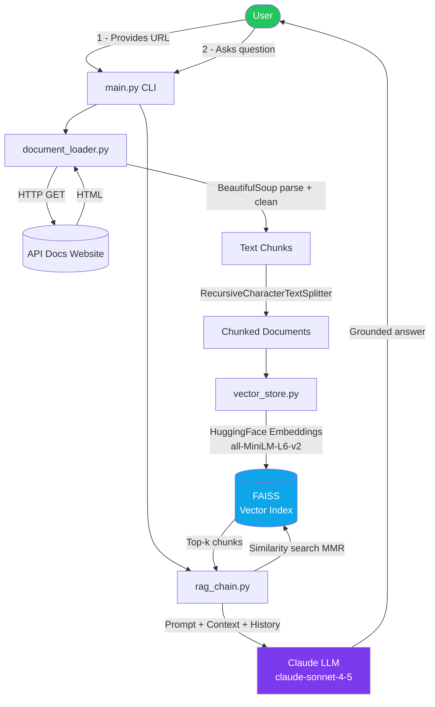

# Architecture

```mermaid
flowchart TD
    A([User]) -->|1 - Provides URL| B[main.py CLI]
    B --> C[document_loader.py]
    C -->|HTTP GET| D[(API Docs Website)]
    D -->|HTML| C
    C -->|BeautifulSoup parse + clean| E[Text Chunks]
    E -->|RecursiveCharacterTextSplitter| F[Chunked Documents]
    F --> G[vector_store.py]
    G -->|HuggingFace Embeddings\nall-MiniLM-L6-v2| H[(FAISS\nVector Index)]
    
    A -->|2 - Asks question| B
    B --> I[rag_chain.py]
    I -->|Similarity search MMR| H
    H -->|Top-k chunks| I
    I -->|Prompt + Context + History| J[Claude LLM\nclaude-sonnet-4-5]
    J -->|Grounded answer| A

    style A fill:#22c55e,color:#fff
    style J fill:#7c3aed,color:#fff
    style H fill:#0ea5e9,color:#fff
```
