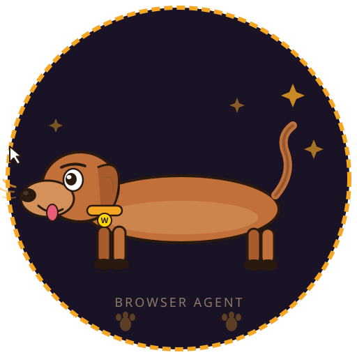

<p align="center">
  
</p>

<h1 align="center">Winnie 🐕</h1>

<p align="center">
  <strong>The dachshund that fetches web pages.</strong><br/>
  An AI browser agent powered by Claude + Playwright.<br/>
  Give natural-language commands. Watch Winnie work.
</p>

<p align="center">
  
  
  
  
  
</p>

---

## What is Winnie?

Winnie is a browser automation agent disguised as a helpful dachshund. You type commands in plain English ("go to google.com and search for the UK population"), and Winnie:

1. Sends your command to **Claude** for planning
2. Receives a step-by-step action plan
3. Executes each step in a live **Chromium** window via **Playwright**
4. Reports results back in the chat

It's like having a tiny sausage dog that can operate a web browser.

## Architecture

```
┌─────────────────────────┐        HTTP        ┌────────────────────────────┐
│   Browser Extension      │ ◄────────────────► │   Python Server (FastAPI)  │
│                          │                    │                            │
│  💬 Chat interface       │                    │  🧠 Claude plans actions   │
│  ⚙️  API key settings    │                    │  🎭 Playwright executes    │
│  ❓ How-to-use guide     │                    │  💾 Chat history storage   │
│  📜 Chat history         │                    │  📸 Screenshot capture     │
└─────────────────────────┘                    └────────────┬───────────────┘
                                                            │
                                                            ▼
                                                   ┌────────────────┐
                                                   │ Chromium Window │
                                                   │ (visible, live) │
                                                   └────────────────┘
```

---

## Quick Start

### 1. Clone & install

```bash
git clone https://github.com/YOUR_USERNAME/winnie.git
cd winnie/server
pip install -r requirements.txt
playwright install chromium
```

### 2. Start the server

```bash
python agent.py
```

Or use the one-command launcher:

```bash
./start.sh
```

The server runs at `http://127.0.0.1:8765`. A Chromium window opens on first command.

### 3. Load the extension

<details>
<summary><strong>Chrome</strong></summary>

1. Open `chrome://extensions`
2. Enable **Developer mode** (top-right toggle)
3. Click **Load unpacked**
4. Select the `extension/` folder
</details>

<details>
<summary><strong>Firefox</strong></summary>

1. Open `about:debugging#/runtime/this-firefox`
2. Click **Load Temporary Add-on**
3. Select `manifest.json` inside `extension/`
</details>

<details>
<summary><strong>Safari</strong></summary>

1. Enable **Develop** menu: Safari → Preferences → Advanced
2. Convert: `xcrun safari-web-extension-converter ./extension`
3. Open the Xcode project → Run
4. Enable in Safari → Preferences → Extensions
</details>

### 4. Add your API key

Click the Winnie extension icon → **Settings** → paste your [Anthropic API key](https://console.anthropic.com) → **Save Key**.

### 5. Give commands!

```
Go to google.com and search total UK population
```

---

## Example Commands

| Command | What Winnie does |
|---|---|
| `Go to google.com and search total UK population` | Opens Google → types query → presses Enter → extracts results |
| `Open youtube.com and search for lofi music` | Navigates to YouTube → searches |
| `Go to wikipedia.org, search "artificial intelligence", extract the first paragraph` | Multi-step research |
| `Take a screenshot` | Captures the current page |
| `Scroll down and click the third link` | Page interaction |
| `Go back` | Browser history navigation |

---

## Supported Browser Actions

| Action | Description | Required fields |
|---|---|---|
| `goto` | Navigate to a URL | `url` |
| `click` | Click an element | `selector` or `value` (text) |
| `type` | Type into a field | `selector` + `value` |
| `press` | Press a key | `value` (e.g. "Enter") |
| `scroll` | Scroll the page | `direction` ("up"/"down") |
| `extract` | Get text from the page | `selector` (optional) |
| `screenshot` | Save a screenshot | — |
| `wait` | Pause | `wait_ms` |
| `back` | Go back | — |
| `forward` | Go forward | — |
| `refresh` | Reload page | — |
| `select` | Choose dropdown option | `selector` + `value` |
| `hover` | Hover over element | `selector` |

---

## Project Structure

```
winnie/
├── server/
│   ├── agent.py              # FastAPI server + Claude planner + Playwright executor
│   └── requirements.txt      # Python dependencies
├── extension/
│   ├── manifest.json          # Manifest V3 (Chrome/Firefox/Safari)
│   ├── popup.html             # Extension UI
│   ├── styles/
│   │   └── popup.css          # Warm dachshund-brown dark theme
│   ├── scripts/
│   │   └── popup.js           # Chat, settings, and connection logic
│   └── icons/
│       ├── icon16.png         # Toolbar icon
│       ├── icon48.png         # Extension page icon
│       └── icon128.png        # Store / large icon
├── docs/
│   └── images/
│       ├── winnie-logo.svg    # Mascot (vector)
│       ├── winnie-256.png     # Mascot (256px)
│       └── winnie-512.png     # Mascot (512px)
├── .github/
│   ├── ISSUE_TEMPLATE/
│   │   ├── bug_report.md
│   │   └── feature_request.md
│   └── PULL_REQUEST_TEMPLATE.md
├── .gitignore
├── .editorconfig
├── LICENSE                    # MIT
├── CHANGELOG.md
├── CODE_OF_CONDUCT.md
├── CONTRIBUTING.md
├── SECURITY.md
├── start.sh                   # One-command launcher
└── README.md                  # You are here
```

---

## API Reference

| Method | Endpoint | Description |
|---|---|---|
| `GET` | `/health` | Health check |
| `POST` | `/execute` | Send a command → plan + execute |
| `POST` | `/config` | Save API key |
| `GET` | `/config` | Check if key is set |
| `GET` | `/history/{session_id}` | Fetch chat history |
| `DELETE` | `/history/{session_id}` | Clear chat history |
| `WS` | `/ws` | Real-time streaming execution |

---

## How It Works

```
 You type a command
        │
        ▼
 Extension sends it to local server (POST /execute)
        │
        ▼
 Server sends command + history to Claude
        │
        ▼
 Claude returns JSON action plan
   [goto, type, press, extract, ...]
        │
        ▼
 Playwright executes each step in Chromium
        │
        ▼
 Results stream back to the extension chat
        │
        ▼
 History saved for future context
```

---

## Configuration & Data

All Winnie's data lives in `~/.winnie/`:

| File | Purpose |
|---|---|
| `config.json` | Your API key (local only, never committed) |
| `chat_history.json` | Server-side conversation history |
| `screenshots/` | Screenshots taken by the `screenshot` action |

The extension also stores chat history and settings in browser `localStorage`.

---

## Requirements

- **Python 3.10+**
- **Chromium** (auto-installed via `playwright install chromium`)
- **Anthropic API key** — get one at [console.anthropic.com](https://console.anthropic.com)
- No Node.js required

---

## Troubleshooting

| Problem | Solution |
|---|---|
| "Can't reach server" | Make sure `python agent.py` is running |
| "API key not configured" | Add your key in the extension's Settings tab |
| Browser window doesn't open | Run `playwright install chromium` |
| Extension not visible | Enable Developer mode, reload the extension |
| Actions failing | Use more specific commands ("click the blue Submit button") |
| Firefox extension disappears on restart | Firefox temporary add-ons are session-only — reload each time |

---

## Contributing

See [CONTRIBUTING.md](CONTRIBUTING.md). PRs welcome — teach Winnie new tricks!

## Security

See [SECURITY.md](SECURITY.md). Your API key stays on your machine.

## License

[MIT](LICENSE) — do whatever you want, just keep the license.

---

<p align="center">
  <em>Winnie: short legs, long reach. 🐕</em>
</p>
